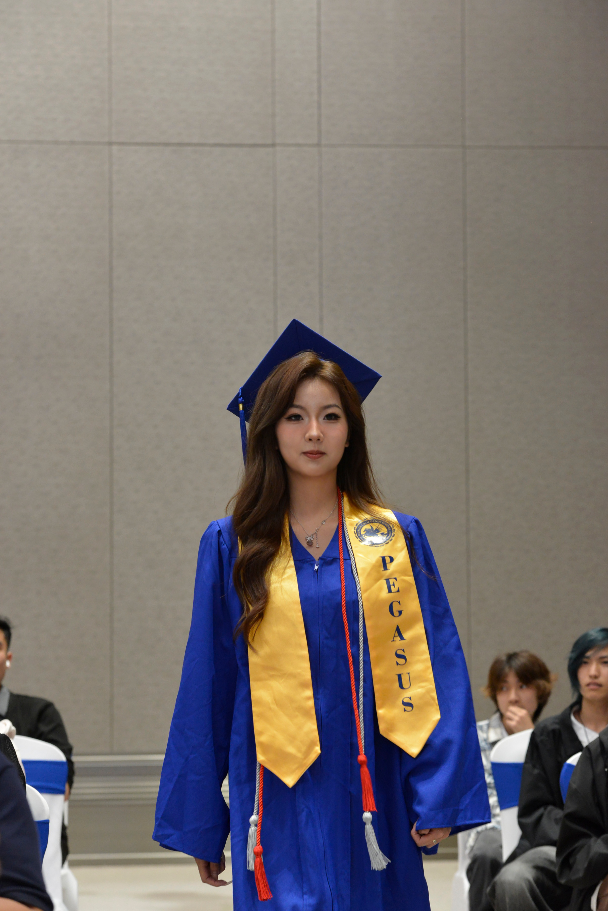

::: {.site-shell}

::: {#home .hero .wire-section}
::: {.hero-copy}
[Home]{.section-label}

# Yunmai Dong

[Statistics & Data Science student at UC Santa Barbara focused on analytics, machine learning, biomedical data, and research-oriented data science.]{.positioning}

[I build reproducible analyses that connect statistical evidence, domain context, and clear communication for scientific and decision-making workflows.]{.quick-summary}

::: {.button-row}
[View Projects](#projects){.button-primary}
[Download Resume](#resume){.button-secondary}
:::
:::

::: {.portrait-wireframe aria-label="Portrait of Yunmai Dong"}

::: {.portrait-fallback aria-hidden="true"}
[YD]{.portrait-initials}
:::

[DATA / SIGNAL / MODEL]{.portrait-caption}
:::
:::

::: {#about .wire-section .split-section}
::: {.section-intro}
[About]{.section-label}

## Statistics, Data Science, and Biomedical Questions
:::

::: {.section-body}
I am a Statistics & Data Science student at UC Santa Barbara interested in data analytics, machine learning, biomedical data, and research-driven analysis.

My work centers on reproducible reports, thoughtful quality control, statistical modeling, and evidence synthesis. I am especially interested in roles where I can help transform complex research or operational datasets into reliable, interpretable insights.

::: {.tag-list aria-label="Skill tags"}
[R]{.tag}

[Python]{.tag}

[SQL]{.tag}

[Quarto]{.tag}

[ggplot2]{.tag}

[tidyverse]{.tag}

[Data Visualization]{.tag}

[Statistical Modeling]{.tag}

[Machine Learning]{.tag}
:::
:::
:::

::: {#projects .wire-section}
::: {.section-header}
::: {}
[Featured Projects]{.section-label}

## Research and Analysis Work
:::

Selected projects across biomedical data, reproducible statistics, and language-focused text analysis.
:::

::: {.project-grid}
::: {.project-card}
[Biomedical Data]{.card-label}

### Spatial Transcriptomics QC for CosMx/AtoMx

**Question:** How can section-level QC identify tissue, segmentation, and assay-quality issues across tumor and organoid spatial transcriptomics data?

**Tools:** AtoMx SIP, QC metrics, spatial transcriptomics analysis.

**Output:** A section-level QC workflow for reviewing tissue quality, comparing runs, and flagging samples for downstream analysis decisions.

::: {.metadata-row}
[AtoMx SIP]{.tag}

[QC Metrics]{.tag}

[Spatial Transcriptomics]{.tag}
:::

[GitHub](#)
[Report](#)
:::

::: {.project-card}
[Biomedical Evidence]{.card-label}

### CAR-T Hypothesis Validation Pipeline

**Question:** Which public biomedical evidence supports or weakens a proposed CAR-T research hypothesis?

**Tools:** Python, GEO, PubMed, ClinicalTrials.gov, statistical testing.

**Output:** A reproducible evidence-scoring pipeline that combines dataset review, literature signals, trial context, and statistical checks.

::: {.metadata-row}
[Python]{.tag}

[GEO]{.tag}

[PubMed]{.tag}

[Statistical Testing]{.tag}
:::

[GitHub](#)
[Report](#)
:::

::: {.project-card}
[Statistical Analysis]{.card-label}

### Data Science Coursework Portfolio

**Question:** How can course-based analyses be made reproducible, well-visualized, and easy to evaluate?

**Tools:** R, Quarto, ggplot2, dplyr, hypothesis testing, ANOVA.

**Output:** A collection of polished statistical reports with clear assumptions, visual summaries, model interpretation, and reproducible code.

::: {.metadata-row}
[R]{.tag}

[Quarto]{.tag}

[ggplot2]{.tag}

[dplyr]{.tag}

[ANOVA]{.tag}
:::

[GitHub](#)
[Report](#)
:::

::: {.project-card .optional-card}
[Text Analysis]{.card-label}

### Reddit Corpus / Text Analysis Project

**Question:** How do online discourse communities develop specialized language, norms, and recurring rhetorical patterns?

**Tools:** Corpus collection, qualitative coding, IMRaD writing.

**Output:** A structured text-analysis report connecting corpus evidence, coded patterns, and community-level interpretation.

::: {.metadata-row}
[Corpus Collection]{.tag}

[Qualitative Coding]{.tag}

[IMRaD Writing]{.tag}
:::

[GitHub](#)
[Report](#)
:::
:::
:::

::: {#experience .wire-section .split-section}
::: {.section-intro}
[Experience]{.section-label}

## Education and Research Experience
:::

::: {.timeline}
::: {.timeline-item}
[Current]{.timeframe}

### Statistics & Data Science Student · UC Santa Barbara

Coursework and projects in statistical modeling, machine learning, data visualization, reproducible reporting, and applied analysis.
:::

::: {.timeline-item}
[Research]{.timeframe}

### Biomedical Data and Spatial Transcriptomics

Experience supporting research-oriented workflows, including section-level QC, biomedical hypothesis evaluation, and evidence synthesis.
:::

::: {.timeline-item}
[Writing]{.timeframe}

### Technical Communication and Reproducible Reports

Prepared concise reports that combine statistical reasoning, visual evidence, and accessible interpretation for technical readers.
:::
:::
:::

::: {#resume .wire-section .resume-band}
::: {}
[Resume]{.section-label}

## Data Science Resume

Interested in data analytics, machine learning, biomedical data, and research-oriented data science internships. Core tools include R, Python, SQL, Quarto, ggplot2, tidyverse, statistical modeling, and machine learning.
:::

[Download Resume](assets/resume.pdf){.button-primary}
:::

::: {#contact .wire-section .contact-section}
[Contact]{.section-label}

## Open to data science internships and research-oriented analytics roles.

::: {.contact-links}
[yunmai.dong@example.com](mailto:yunmai.dong@example.com)
[LinkedIn](https://www.linkedin.com/in/yunmai-dong/)
[GitHub](https://github.com/yunmai-dong)
:::
:::

:::
